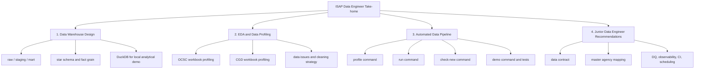
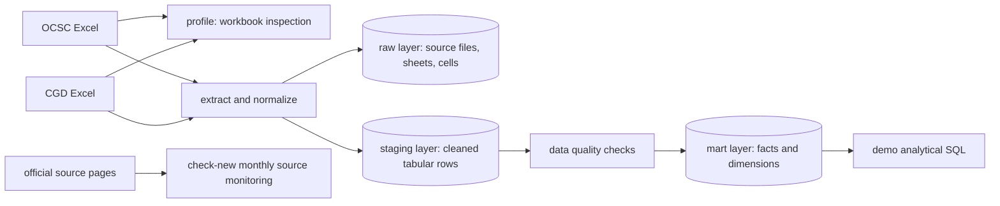

# Submission Overview

หน้านี้เป็นหน้าเปิดอ่านเร็วสำหรับ reviewer/interviewer เพื่อเห็นภาพว่า repo นี้ตอบโจทย์หลักครบอย่างไร และไฟล์ไหนควรเป็น source artifact หรือ generated artifact

## 4 Core Deliverables



## Pipeline At A Glance



## Evidence Map

| Deliverable | Main Evidence | Notes |
|---|---|---|
| Data Warehouse design | `docs/warehouse_design.md`, `sql/001_create_raw.sql`, `sql/002_create_staging.sql`, `sql/003_create_marts.sql` | มี architecture, ERD, table inventory, fact grain และ design tradeoffs |
| EDA and Data Profiling | `notebooks/01_eda_data_profiling.ipynb`, `docs/data_profiling_report.md` | แยก OCSC และ CGD ชัดเจน พร้อม workbook/sheet-level profiling |
| Automated Data Pipeline | `src/isap_pipeline/`, `sql/`, `.github/workflows/ci.yml`, `.github/workflows/monthly-check.yml` | มี extraction, cleaning, loading, DQ, idempotency, source monitoring และ tests |
| Junior Recommendations | `docs/junior_recommendations.md` | ข้อเสนอ production readiness จากมุม Junior Data Engineer |
| Demo Readiness | `README.md`, `docs/demo_script.md`, `sql/004_sample_queries.sql` | มีคำสั่ง setup/profile/run/demo/test ที่รันตามได้ |

## Artifact Policy

| Type | Commit to GitHub? | Reason |
|---|---|---|
| Source code, SQL, tests, docs, notebooks | Yes | เป็น deliverable และต้อง review ได้ |
| Small source Excel datasets used for demo | Yes | ทำให้ reviewer clone แล้วรัน pipeline ได้ทันที |
| `data/warehouse/*.duckdb` | No | เป็น generated warehouse output; ควร rebuild จาก code + source data เพื่อพิสูจน์ reproducibility |
| `data/processed/*.json` | No | เป็น generated profiling/DQ/source-check output; command สามารถสร้างใหม่ได้ |
| `references/` | No | เป็น internal/private reference material |
| agent prompt / working brief | No | เป็น local working artifact ไม่ใช่ deliverable |
| original assignment PDF | No | ไม่จำเป็นต่อ public solution repo และหลีกเลี่ยงการเผยแพร่ไฟล์โจทย์ต้นฉบับ |

## Why Ignore `.duckdb`

ไฟล์ `.duckdb` ในงานนี้เป็นผลลัพธ์จาก pipeline ไม่ใช่ source of truth จึงควร ignore ไว้ เพื่อให้ reviewer เห็นว่า warehouse สร้างซ้ำได้ด้วยคำสั่ง:

```powershell
python -m isap_pipeline run --ocsc "datasets/ocsc/thai-gov-manpower-2567.4.xlsx" --cgd "datasets/cgd/2026.07.03.xlsx" --warehouse "data/warehouse/isap.duckdb"
```

ถ้าต้องการส่ง demo แบบ offline มาก ๆ สามารถแนบ `.duckdb` แยกเป็น release artifact หรือไฟล์ zip ส่วนตัวได้ แต่ไม่ควร commit ลง repo หลัก เพราะจะทำให้ repo หนักขึ้นและเสี่ยงมี stale output ที่ไม่ตรงกับ code ล่าสุด

