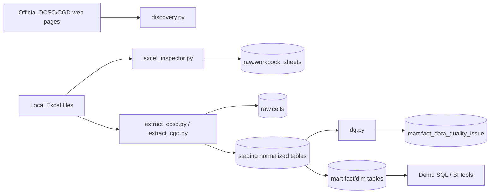
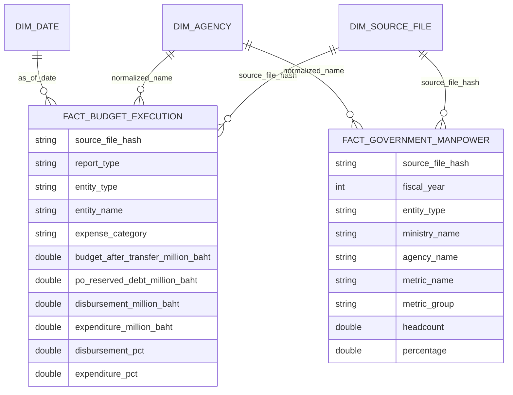

# Warehouse Design

## หลักการและเหตุผล

Excel ต้นทางเป็น report workbook ไม่ใช่ normalized source table จึงต้องแยก raw/staging/mart ให้ชัดเจน เพื่อให้ตรวจสอบย้อนหลังได้และลดความเสี่ยงจาก merged cells, formula, multi-row header และ subtotal rows

DuckDB ถูกเลือกเพราะรัน local demo ได้เร็ว ไม่ต้องตั้ง database server และรองรับ SQL analytical query ได้ดี

## Architecture

## Layer Design

| Layer | Purpose | Examples |
|---|---|---|
| raw | เก็บหลักฐานจาก source โดยไม่เสีย context | `raw.source_files`, `raw.workbook_sheets`, `raw.cells` |
| staging | clean/normalize Excel report เป็นตารางที่ query ได้ | `staging.cgd_budget_execution`, `staging.ocsc_workforce` |
| mart | star schema สำหรับ analyst | `mart.fact_budget_execution`, `mart.fact_government_manpower`, `mart.dim_agency` |

## Star Schema

## Fact Grain

| Fact | Grain |
|---|---|
| `fact_government_manpower` | หนึ่ง row ต่อ fiscal_year, source sheet, entity, metric |
| `fact_budget_execution` | หนึ่ง row ต่อ fiscal_year, as_of_date, source sheet, entity, report_type, expense_category |
| `fact_ingestion_run` | หนึ่ง row ต่อ pipeline run |
| `fact_data_quality_issue` | หนึ่ง row ต่อ DQ check result |

## Table Inventory

| Table | Description |
|---|---|
| `raw.source_files` | file metadata, hash, source page, fiscal year |
| `raw.workbook_sheets` | sheet-level profile เช่น rows, columns, merged cells, formulas |
| `raw.cells` | non-empty cell values ทุก workbook |
| `staging.cgd_budget_execution` | normalized CGD rows แยก report_type และ expense_category |
| `staging.ocsc_workforce` | normalized OCSC workforce metric rows |
| `mart.fact_budget_execution` | analyst-ready budget fact |
| `mart.fact_government_manpower` | analyst-ready manpower fact |
| `mart.dim_agency` | conformed agency/entity dimension จาก OCSC และ CGD |
| `mart.dim_source_file` | source metadata dimension |
| `mart.dim_date` | date dimension จาก CGD as_of_date |

## Data Dictionary สรุป

| Column | Meaning |
|---|---|
| `source_file_hash` | SHA-256 ของไฟล์ ใช้ lineage และ idempotent load |
| `report_type` | `disbursement` หรือ `expenditure` |
| `expense_category` | `current`, `investment`, `total` |
| `budget_after_transfer_million_baht` | วงเงินงบประมาณหลังโอนเปลี่ยนแปลง หน่วยล้านบาท |
| `disbursement_million_baht` | ยอดเบิกจ่าย หน่วยล้านบาท |
| `expenditure_million_baht` | ยอดใช้จ่าย หน่วยล้านบาท |
| `headcount` | จำนวนคน |
| `metric_name` | ชื่อ metric เช่น `civil_servant`, `gender_female`, `education_master` |

## Design Tradeoffs

- เก็บ raw cell เพราะ Excel เป็น report layout และอาจต้องย้อน audit cell ต้นทาง
- แยก disbursement กับ expenditure เพราะ CGD ให้ความหมายต่างกัน: เบิกจ่ายคือเงินจ่ายจริง ส่วนใช้จ่ายรวมภาระ/PO บางมุมมอง
- เก็บ `fiscal_year_be` คู่กับ `fiscal_year` เพราะ source ไทยใช้ พ.ศ. แต่ระบบ analytics ใช้ ค.ศ.
- conformed dimensions ช่วยให้ analyst join ข้าม dataset ได้ แต่ต้องมี master mapping เพื่อแก้ชื่อหน่วยงานไม่ตรงกัน
