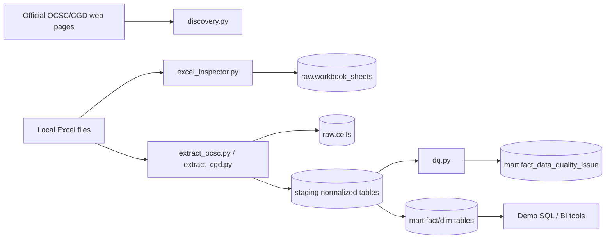
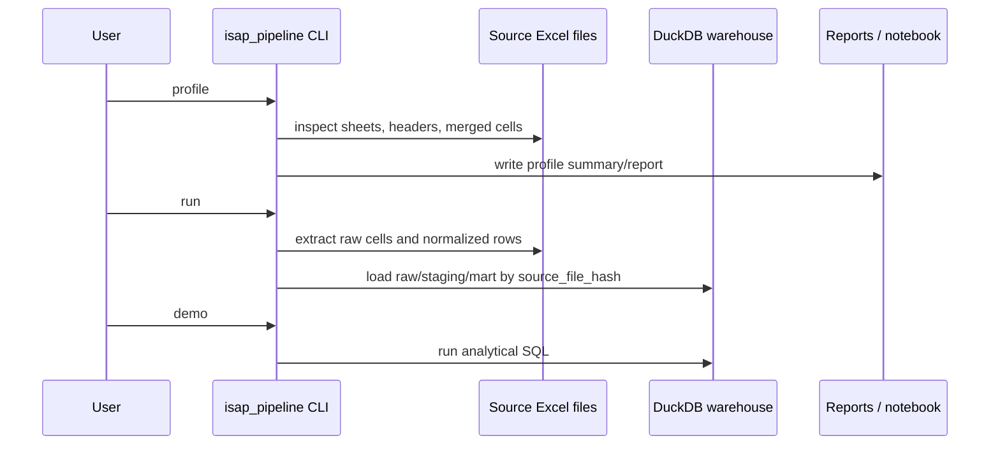
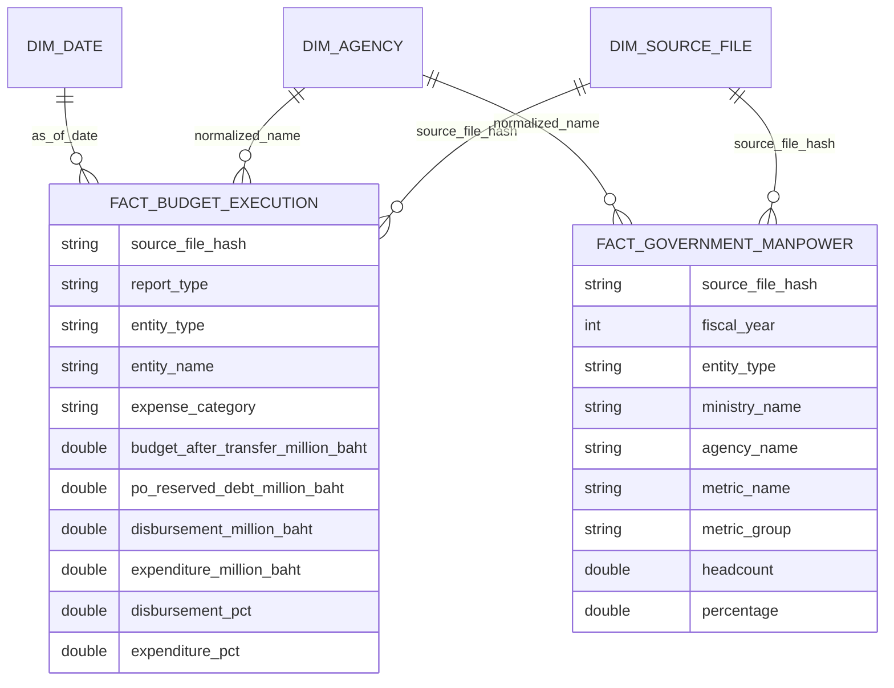

# การออกแบบคลังข้อมูล (Warehouse Design)

## หลักการและเหตุผล

Excel ต้นทางเป็น report workbook ไม่ใช่ normalized source table จึงต้องแยก raw/staging/mart ให้ชัดเจน เพื่อให้ตรวจสอบย้อนหลังได้และลดความเสี่ยงจาก merged cells, formula, multi-row header และ subtotal rows

DuckDB ถูกเลือกเพราะรัน local demo ได้เร็ว ไม่ต้องตั้ง database server และรองรับ SQL analytical query ได้ดี

## สรุปให้เข้าใจง่าย

- `raw` คือสำเนาหลักฐานจาก Excel ต้นทาง
- `staging` คือข้อมูลที่จัดรูปแบบให้อ่านเป็นตารางได้
- `mart` คือตารางที่เตรียมให้ Data Analyst ใช้ query
- การแบ่งชั้นทำให้แก้ parser ได้โดยไม่ทำต้นทางหาย และช่วยไม่ให้ query รวม total กับ detail โดยไม่ตั้งใจ

คำศัพท์เพิ่มเติมอยู่ที่ [docs/terms_explained.md](terms_explained.md)

## สี่เรื่องที่ design นี้ตั้งใจให้เห็น

warehouse design นี้ตั้งใจโชว์ 4 เรื่องหลัก:

1. สร้างซ้ำได้: source Excel กับ code สร้าง warehouse ใหม่ได้ จึงไม่ต้อง commit `.duckdb`
2. ตรวจย้อนกลับได้: raw layer เก็บข้อมูลไฟล์, sheet และ cell ต้นทาง
3. ใช้วิเคราะห์ได้: mart แปลง Excel report เป็นตารางตัวเลขและตารางประกอบที่ query ได้
4. ขยายต่อได้: ถ้ามีปีหรือ release ใหม่ สามารถเพิ่ม ingestion run และ mapping โดยไม่ทิ้ง design เดิม

## Architecture

## Rebuild and Lineage Flow

## แต่ละชั้นเก็บอะไร

| ชั้นข้อมูล | หน้าที่ | ตัวอย่าง |
|---|---|---|
| raw | เก็บหลักฐานจาก source โดยไม่เสียบริบท | `raw.source_files`, `raw.workbook_sheets`, `raw.cells` |
| staging | จัด Excel report ให้เป็นตารางที่ query ได้ | `staging.cgd_budget_execution`, `staging.ocsc_workforce` |
| mart | ตารางสำหรับ analyst: ตัวเลขหลักและข้อมูลประกอบ | `mart.fact_budget_execution`, `mart.fact_government_manpower`, `mart.dim_agency` |

## Analytical Questions Supported

| Question | Main table/view | Notes |
|---|---|---|
| หน่วยงานใดมีกำลังพลสูงสุด | `mart.fact_government_manpower` | filter ด้วย `metric_name`, `entity_type` |
| กระทรวง/หน่วยงานใดเบิกจ่ายต่ำ | `mart.fact_budget_execution` | ใช้ `disbursement_pct`, `expense_category`, `report_type` |
| ใช้จ่ายเทียบเป้ารายเดือนต่างจากเป้าเท่าไร | `mart.fact_budget_execution` | ใช้ `monthly_target_gap_pct` |
| หน่วยงานที่ match กันระหว่าง OCSC และ CGD มีภาพ workforce vs budget อย่างไร | `mart.dim_agency` + fact tables | demo ใช้ exact normalized Thai name; production ควรใช้ master mapping |

## Star Schema

## Fact Grain

| Fact | Grain |
|---|---|
| `fact_government_manpower` | หนึ่ง row ต่อ fiscal_year, source sheet, entity, metric |
| `fact_budget_execution` | หนึ่ง row ต่อ fiscal_year, as_of_date, source sheet, entity, report_type, expense_category |
| `fact_ingestion_run` | หนึ่ง row ต่อ pipeline run |
| `fact_data_quality_issue` | หนึ่ง row ต่อ DQ check result |

## Table Inventory

| Table | Description |
|---|---|
| `raw.source_files` | file metadata, hash, source page, fiscal year |
| `raw.workbook_sheets` | sheet-level profile เช่น rows, columns, merged cells, formulas |
| `raw.cells` | non-empty cell values ทุก workbook |
| `staging.cgd_budget_execution` | normalized CGD rows แยก report_type และ expense_category |
| `staging.ocsc_workforce` | normalized OCSC workforce metric rows |
| `mart.fact_budget_execution` | analyst-ready budget fact |
| `mart.fact_government_manpower` | analyst-ready manpower fact |
| `mart.dim_agency` | conformed agency/entity dimension จาก OCSC และ CGD |
| `mart.dim_source_file` | source metadata dimension |
| `mart.dim_date` | date dimension จาก CGD as_of_date |

## Data Dictionary สรุป

| Column | Meaning |
|---|---|
| `source_file_hash` | SHA-256 ของไฟล์ ใช้ lineage และ idempotent load |
| `report_type` | `disbursement` หรือ `expenditure` |
| `expense_category` | `current`, `investment`, `total` |
| `budget_after_transfer_million_baht` | วงเงินงบประมาณหลังโอนเปลี่ยนแปลง หน่วยล้านบาท |
| `disbursement_million_baht` | ยอดเบิกจ่าย หน่วยล้านบาท |
| `expenditure_million_baht` | ยอดใช้จ่าย หน่วยล้านบาท |
| `headcount` | จำนวนคน |
| `metric_name` | ชื่อ metric เช่น `civil_servant`, `gender_female`, `education_master` |

## Data Quality and Operations

| Control | Implemented in this repo | Why it matters |
|---|---|---|
| idempotent load | `load.py` delete-insert by `source_file_hash` | รันซ้ำแล้วไม่ duplicate |
| source lineage | `raw.source_files`, `source_file_hash`, `ingestion_run_id` | trace กลับไปหาไฟล์ต้นทางได้ |
| sheet inventory | `raw.workbook_sheets` | ตรวจ structure change ของ workbook ได้ |
| core DQ checks | `dq.py`, `mart.fact_data_quality_issue` | ตรวจ percent range, non-negative, duplicate grain |
| monthly source check | `discovery.py`, `.github/workflows/monthly-check.yml` | ตรวจว่ามี dataset ใหม่หรือ source unavailable |
| CI | `.github/workflows/ci.yml` | ให้ tests/lint ทำงานบน GitHub |

## Design Tradeoffs

- เก็บ raw cell เพราะ Excel เป็น report layout และอาจต้องย้อน audit cell ต้นทาง
- แยก disbursement กับ expenditure เพราะ CGD ให้ความหมายต่างกัน: เบิกจ่ายคือเงินจ่ายจริง ส่วนใช้จ่ายรวมภาระ/PO บางมุมมอง
- เก็บ `fiscal_year_be` คู่กับ `fiscal_year` เพราะ source ไทยใช้ พ.ศ. แต่ระบบ analytics ใช้ ค.ศ.
- conformed dimensions ช่วยให้ analyst join ข้าม dataset ได้ แต่ต้องมี master mapping เพื่อแก้ชื่อหน่วยงานไม่ตรงกัน
